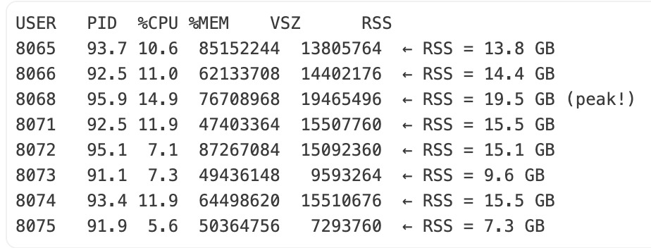
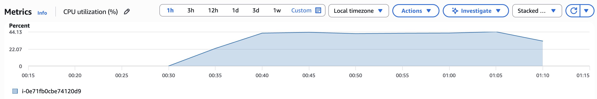
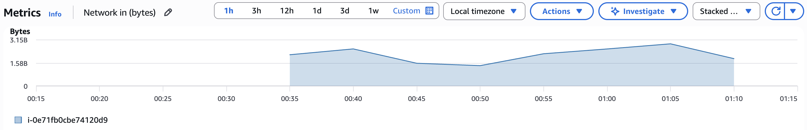
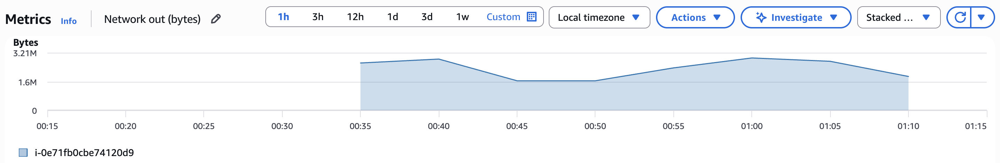
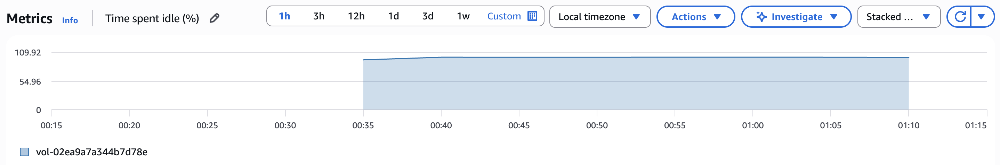
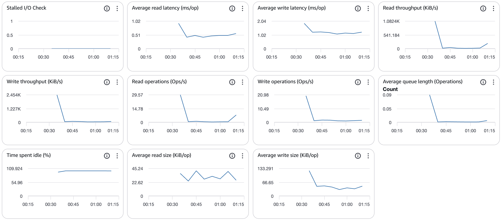

# EC2 Instance Monitoring


## Overview

This doc covers:
1. Understanding system resources (RAM, Disk, CPU, Network)
2. Processing 60GB taxi data challenge
3. How to monitor EC2 instances effectively
4. Taxi analysis case study and optimization strategies

---

## Part 1: System Resources Fundamentals

### The Three Key Resources

#### 💾 RAM (Memory)
- **Purpose:** Temporary storage for running programs
- **Speed:** Extremely fast
- **Example size:** r8i.4xlarge has 123GB
- **What happens when full:** System slows down or kills processes (OOM - Out of Memory)
- **Cost:** Expensive

#### 💿 Disk (Storage)
- **Purpose:** Permanent storage for files
- **Speed:** Milliseconds (~1000x slower than RAM)
- **Example size:** r8i.4xlarge has 8GB root volume
- **What happens when full:** Can't write new files
- **Cost:** Cheaper than RAM

#### 🔧 vCPUs (Virtual CPUs)
- **Purpose:** Processing power - the "workstations" for your workers
- **Measurement:** Number of cores available
- **Usage:** Measured as % utilization (100% = all cores fully busy)


**Workers** = Number of people doing the job (Python processes)  
**vCPUs** = Number of workstations available (CPU cores)  
**Partition Size** = Controls how much of each parquet file is loaded into RAM at once. 512 MB, 256 MB, 1024 MB, etc.


## Part 2: The Challenge

<span style="color: #b45309;"><strong>Goal:</strong> Properly utilize the instance to the max extent possible. These are costly instances 💰 — squeeze the last bit of performance to balance cost and efficiency.</span>

- Process 60GB of taxi data (443 parquet files) living on S3
- **Processing**: Happens in RAM (that's why you need 64GB RAM). Script streams 1 file at a time from S3 directly into RAM.
- **Output to disk**: Only the tiny pivoted/aggregated results
- **Clears RAM** and moves to next file


## Part 3: Monitoring Your EC2 Instance

### Monitor #1: RAM Usage (Command Line - real time)

```bash
ps aux | grep -E 'python|PID' | grep -v grep
```

You can see the RSS (Resident Set Size) column for each worker / 10^6 (for GBs). RSS column = actual physical RAM used by that process. As u can see Average: ~13-15 GB per worker.



**Overall RAM %:** Sum the RSS values (in GB) across all workers/processes, then divide by the instance’s total RAM. If it’s **> 90%** → ⚠️ **BOTTLENECK**


### Monitor #2: CPU Utilization (AWS Console)

**How to access:** In AWS Console, navigate to EC2 → Instances → Select your instance → Click the **"Monitoring"** tab

**What is CPU Utilization?**
- % of total vCPU capacity being used
- On a 16-vCPU instance:
  - 100% = all 16 cores fully busy
  - 50% = ~8 cores busy
  - 25% = ~4 cores busy

**Example on a 8 vCPU instance:**
- 326% CPU from processes ÷ 8 cores = 41% utilization
- **Interpretation:** Plenty of CPU headroom! Not the bottleneck.



**Trade-off:**
- ✅ **Smaller partition = Less RAM** → Safer, won't crash
- ❌ **Smaller partition = More chunks** → Slightly slower processing
- 💡 **With lower RAM usage**, you could potentially increase workers from 3 to 5-6 and still be safe

**Why CPU drops at the end:**
- Workers are downloading last files from S3 (I/O bound)
- Not processing data (CPU bound)


### Monitor #3: Network Metrics (AWS Console)

**How to access:** In AWS Console, navigate to EC2 → Instances → Select your instance → Click the **"Monitoring"** tab → Scroll to Network section

| Metric | Value | What it means |
|--------|-------|---------------|
| **Network In** | 1.4 - 2.8 GB | Actively downloading files from S3 |
| **Network Out** | 1.6 - 3.2 MB | SSH connection overhead + S3 API calls (metadata requests) |
| **Ratio** | ~1000:1 | ✅ Expected for data processing, downloading way more than uploading |

**Why monitor network?**
- Verify job is running (Network In > 0)
- Spot issues (Network In flat = not downloading)

**Network In:**


**Network Out:**


### Monitor #4: Disk Metrics (AWS Console)

**How to access:** In AWS Console, navigate to EC2 → Instances → Select your instance → Click the **"Monitoring"** tab → Scroll to Disk/EBS section

| Metric | Expected Value | Why |
|--------|---------------|-----|
| **Read/Write Latency** | <5ms | Only tiny result files |
| **Time Spent Idle** | >95% | Disk mostly unused (data in RAM) |
| **Read Throughput** | <100 KiB/s | Reading from S3, not disk |
| **Write Throughput** | <1000 KiB/s | Small result files only |

**Key insight:** When processing data from S3, disk is barely used!



### Monitor #5: Storage Metrics (AWS Console)

**How to access:** In AWS Console, navigate to EC2 → Instances → Select your instance → Click the **"Storage"** tab

| Metric | What it measures | Expected for your workload |
|--------|------------------|---------------------------|
| **Read Latency (ms/op)** | Time to read from local disk per operation | Very low (<5ms) - You're barely reading from disk, mostly from S3 |
| **Write Latency (ms/op)** | Time to write to local disk per operation | Very low (<5ms) - Only writing tiny result files |
| **Time Spent Idle (%)** | % of time disk is doing nothing | Very high (>95%) - Disk mostly unused |
| **Read Throughput (KiB/s)** | Data read from disk per second | Very low (<100 KiB/s) - Not reading from disk, reading from S3 |
| **Write Throughput (KiB/s)** | Data written to disk per second | Very low (<1000 KiB/s) - Only small result files |



---

## Part 4: Taxi Analysis Case Study

### Tuning workers and partition size - r8i.4xlarge (16 vCPUs, 128GB RAM)
- **1 worker**: Simple, no multiprocessing, no async issues → but very slow.
- **8 workers:** ❌ Multiprocessing cleanup caused deadlocks. High complexity.
- **3 workers:** ✅ Works, moderate complexity, occasional cleanup issues.
- **Time:** 30 minutes

**What actually makes 3 workers better:**
1. **RAM pressure** - With 8 workers you were at **97% RAM usage** (108GB/123GB). Each worker uses ~15GB. With 3 workers you'll use ~45GB = plenty of headroom. When RAM is maxed out, things hang.
2. **Multiprocessing pool complexity** - With 8 workers, the pool management gets complex. More workers = more chance of deadlock in the pool cleanup phase. 3 workers = simpler, less likely to hang.

**Key findings:**
- If you are facing OOM (Out of Memory) issues - try decreasing the partition size
- Smaller partition size = less RAM usage per worker
- more #workers hits multiprocessing complexity issues
- **Perfect balance:** Performance + stability + cost! 🎯


## Key Takeaways

1. **Identify your bottleneck:** Use monitoring to find if it's RAM, CPU, or Network
2. **More workers ≠ Better:** Each worker needs RAM and adds complexity
3. **Right-size your instance:** Don't pay for resources you don't use
4. **Monitor holistically:** CPU, RAM, Network, and Disk together tell the story
5. **Iterate and measure:** Small changes, measure impact, repeat

